# 从零搭建一套结构光3D重建系统 [理论+源码+实践]

购买地址：[从零搭建一套结构光3D重建系统 [理论+源码+实践]](https://app0s6nfqrg6303.h5.xiaoeknow.com/v1/goods/goods_detail/p_615ee615e4b0b558b93701f7?type=3)

课件地址：https://pan.baidu.com/s/1UNg8FnZvibrLdW8rgDxDWQ

注：联系客服索要百度提取码！课件会持续更新！

## 01 背景介绍

| 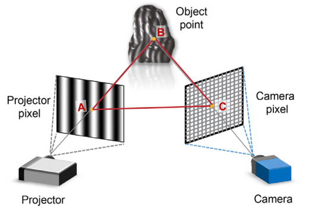 |
| :-------------------: |
| 图1 典型3D结构光系统  |

注：图片引用自论文《Calibration of fringe projection profilometry: A comparative review》

> **尽管结构光作为一种已经相当成熟，并且广泛应用的三维重建技术，不同于深度学习，依旧缺乏相关的课程，网上的开源资料寥寥无几，即使有，也是晦涩难懂，许多刚入门的研究者需要花费大量时间入门（其中也不乏笔者本人）。不少这方面的研究生，如果缺少实验室传承，一年学编程技术，一年看文献入门结构光，刚刚迈入科研又要面临找工作的问题了。**

其实结构光不同于SLAM，并不是一项复杂的技术，相信你看完这门课程后一定会颇有感慨！因而，3D视觉工坊推出课程：**[从零搭建一套结构光3D重建系统 [理论+源码+实践]**，帮助大家更快地入门结构光技术，助力大家科研！

## 02 课程大纲

**从零搭建一套结构光3D重建系统 [理论+源码+实践]** 

[**第01章：结构光前奏：双目立体匹配算法**](https://www.bilibili.com/video/BV1V64y1h7LW/)

[**第02章：单目标定理论+实践：计算内参，去除畸变**](https://www.bilibili.com/video/BV1V64y1h7LW?p=2)

[**第03章：双目标定理论+实践：确定相机相互位置**](https://www.bilibili.com/video/BV1V64y1h7LW?p=4)

[**第04章：双目立体匹配算法理论+OpenCV实践**](https://www.bilibili.com/video/BV1V64y1h7LW?p=7)

**第05章：主动标记区域：相移法+多频外差**

**第06章：主动标记区域：相移法+格雷码**

**第07章：双目重建实践：三角测距法**

**第08章：单目重建实践：逆相机法**

**第09章：单目重建实践：相高法**

**第10章：投影仪的非线性校正**

**第11章：结构光+深度学习**

**补充1：工业相机与普通相机区别**

**补充2：选取投影仪性能指标**

**补充3：工业相机、投影仪的硬触发**

**课程大作业：搭建一套实际结构光3D重建系统（QT C++）**

> 注：后续课程需要购买，这套课程，几乎每一节课，笔者都认真准备了数据集、代码，整个课程本着：问题为导向，实践+理论结合的原则，带领大家真正学会3D结构光技术！

## 03 课程亮点

本门课程面向实战，带你从零实现一套结构光3D系统，包括一些常见的结构光重建方法。几乎每一个章节都配备有相应的讲义、代码，帮助大家更好地理解结构光技术。例如章节[相移法+多频外差]的部分PPT：

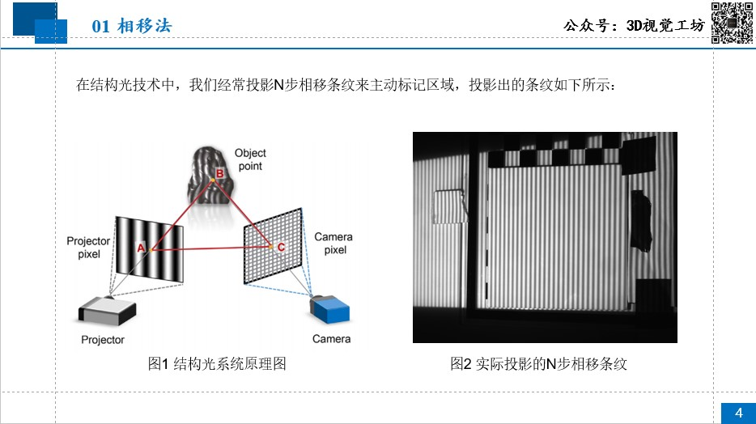

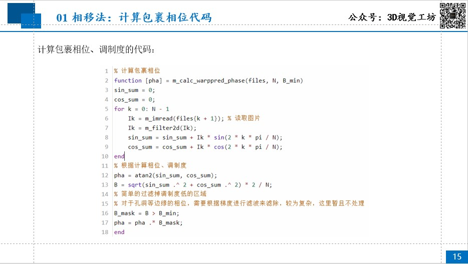

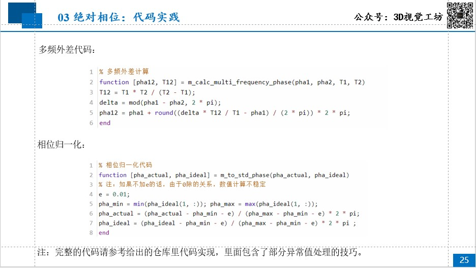

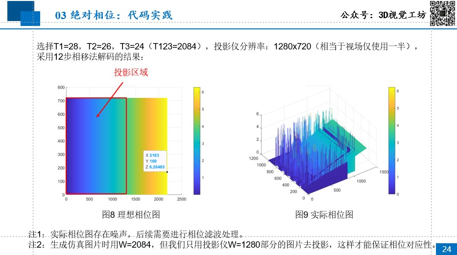

再比如[相移法+格雷码]的课件：

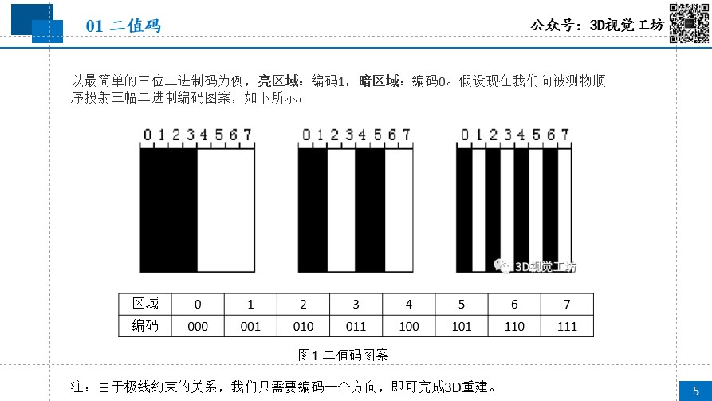

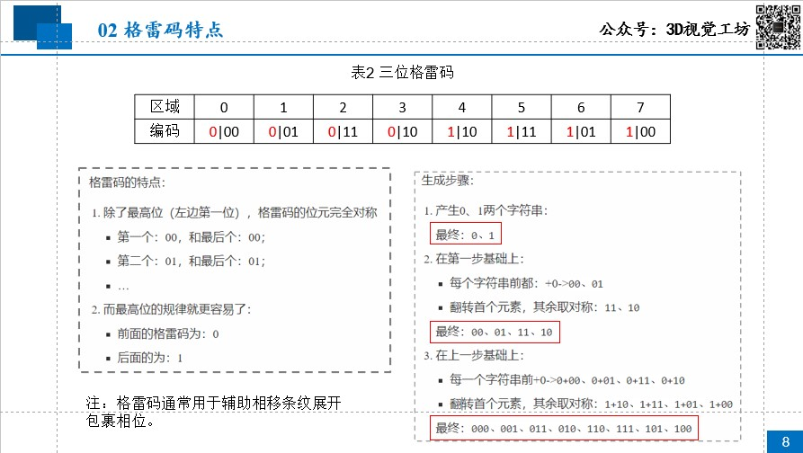

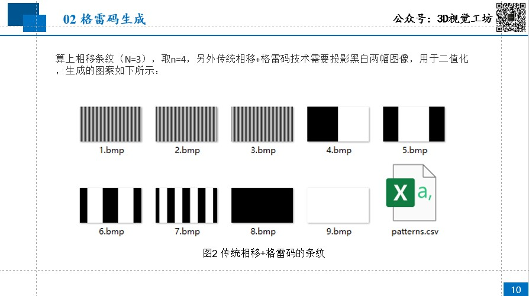

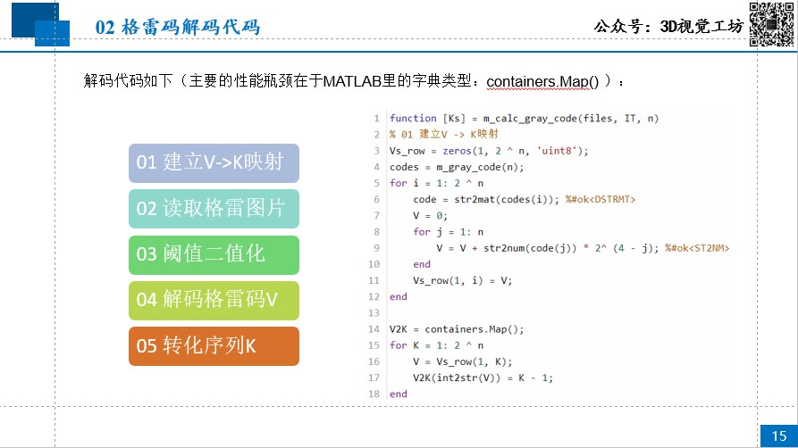

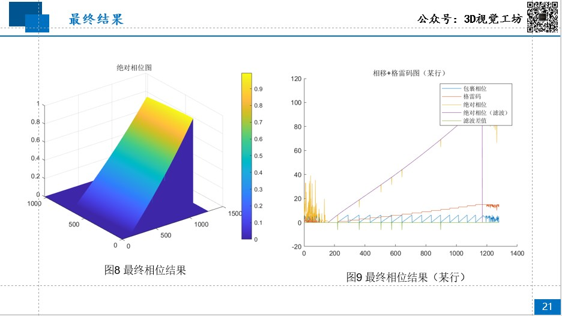

为了更贴近实际，我们还介绍了硬件部分的讲解与代码编写，下面是部分讲义：

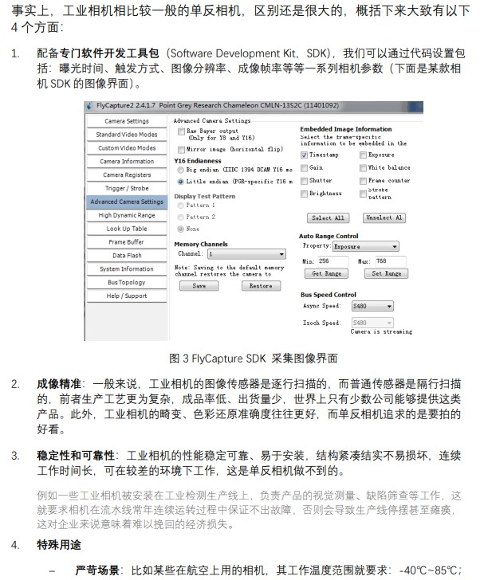

为了更贴近学术前沿，我们还准备了结构光+深度学习的源码+讲解！部分课程请看B站链接：[从零搭建一套结构光3D重建系统[理论+源码+实践]](https://www.bilibili.com/video/BV1V64y1h7LW/)。

## 04 面向人群

1. 刚入门面结构光技术的本科生、硕士生

2. 需要一定进阶的一线算法工程人员

3. 有一定编程基础，能够阅读一些相关文献 [可选]

## 05 学会收获

1. 对结构光技术的各个模块有较为深刻的理解

2. 用C++搭建一套真正能够实用的3D结构光三维重建系统

3. 面向工业级实现，所学内容对标相关岗位要求

## 06 课程版权

- **署名权**
  必须为原始作者署名，然后才可以修改，分发，复制。
- **不能衍生新作品**
  作品可以被修改，分发，复制，但不能以此为基础创作自己的作品，即利用该源码制作相类似的课程。

